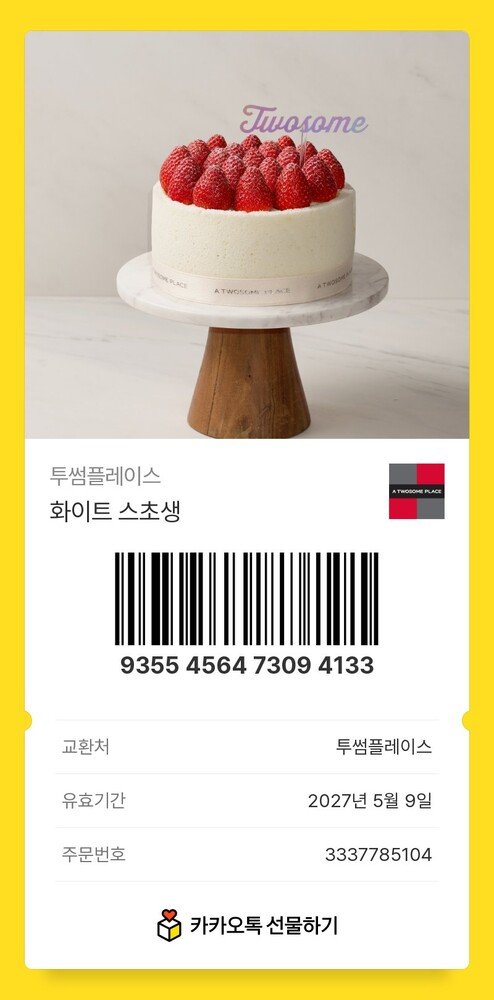

# 어버이날 기념 웹사이트 💐

아빠 엄마께 드리는 작은 사이트입니다.

## 📁 파일 구조

```
parents-day/
├── index.html          ← 메인 페이지
├── images/             ← 사진 폴더
│   ├── 80852.jpg
│   ├── 84622.jpg
│   ├── ...
│   └── coupon.jpg      ← (나중에 추가) 케이크 쿠폰 이미지
└── README.md
```

## 🎂 케이크 쿠폰 추가하는 법

1. 쿠폰 이미지를 `coupon.jpg` 라는 이름으로 `images/` 폴더에 넣어주세요.
2. `index.html` 파일을 열어서 아래 부분을 찾아주세요:

```html
<!-- 쿠폰 이미지를 여기에 -->
<!--  -->
<div class="coupon-placeholder">— 쿠폰 이미지 자리 (coupon.jpg) —</div>
```

3. 아래처럼 바꿔주세요 (주석 풀고 placeholder 삭제):

```html

```

## 🚀 GitHub Pages 배포

1. GitHub에 새 저장소를 만들어주세요 (예: `parents-day`)
2. 모든 파일을 push 하세요:
   ```bash
   git init
   git add .
   git commit -m "어버이날 사이트"
   git branch -M main
   git remote add origin https://github.com/<your-username>/parents-day.git
   git push -u origin main
   ```
3. 저장소 → **Settings** → **Pages**
4. **Source**: `Deploy from a branch` 선택
5. **Branch**: `main` / `root` 선택 후 Save
6. 1~2분 후 `https://<your-username>.github.io/parents-day/` 에서 확인 가능합니다.

## ✏️ 수정하고 싶은 부분

- **편지 내용**: `index.html` 의 `<section class="letter">` 부분
- **사진 캡션**: 각 `<div class="caption">...</div>` 에서 수정
- **색상**: `:root` 안의 CSS 변수 (`--carnation`, `--gold` 등) 변경
